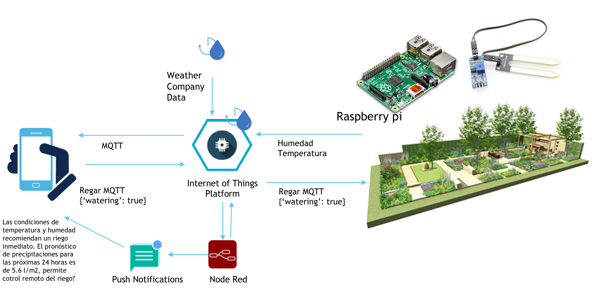

# Ciudades mas verdes- Jardines inteligentes

## Índice

1. [Descripción](https://github.com/aldupe/JardinesInteligentes#descripción)
2. [Caso de negocio](https://github.com/aldupe/JardinesInteligentes#caso-de-negocio)
3. [Prototipo](https://github.com/aldupe/JardinesInteligentes#prototipo)
4. [ROI](https://github.com/aldupe/JardinesInteligentes#roi)
5. [Capturas](https://github.com/aldupe/JardinesInteligentes#capturas)
6. [Node-red flows](https://github.com/aldupe/JardinesInteligentes/tree/master/node-red-flows)

## Descripción

*Proyecto para participar en el Hackaton interno de IBM.* 

¿A quien no le gustaría vivir en una ciudad mas verde? El Objetivo es desarrollar una aplicación rápida y sencilla con los servicios de [Bluemix](https://bluemix.net) y [NodeRed](https://nodered.org/), para facilitar el mantenimiento de los jardines de nuestra ciudad y nuestras casas.

## Caso de negocio

Los sistemas de riego programado muchas veces desperdician grandes cantidades de aguas, bien porque haya llovido y no sea necesario riego, exista fuga en el sistema de riego o desgaste y rotura en algunos de los componentes. Ademas de perder efectividad puede encargar zonas de jardín o calles malgastando, agua, y provocando incidentes o caídas en aceras. Hoy en día con el abaratamiento de los sensores podemos monitorizar los puntos mas críticos del sistema de riego mejorar su mantenimiento y hacerlo mas efectivo.

### Funcionalidades

- **Jardín incorpora el riego automatizado**: Este riego automático a parte de recoger los datos de los sensores que el jardín tiene distribuidos, - **Sistema de riego y nutrición simultáneo**: Los sensores,disponen de célula fotovoltaica y son capaces de detectar humedad, temperatura, luz y abono. 
El servicios de Watson IoT nos permite:
  Monitorizar los distintos valores,de esta forma saber lo que realmente necesitan las plantas del jardín.Ademas se   integra con el servicio de The **Weather Channel** para conocer las condiciones meteorológicas y poder ajustar el riego a cada momento en función de la climatología actual y prevista modificando la programación del riego de forma automática. 
  Definir alertas de cuando sus niveles bajan del umbral definido por el tipo de planta y ejecutar acciones especificas haciendo que se activen mecanismos del sistema de riego o se avise al jardinero encargado y opte por tomar el control remoto y modificar programa de riego.

- **Alerta de mantenimiento**: Con los caudalimetros distribuidos por el sistema de riego y conectados a la plataforma IoT alertan de posibles fugas al equipo de mantenimiento de jardinería para la reparación o dependiendo del nivel de criticada y del tiempo lanza acción como corte de agua.
Los jardineros tendrán acceso a la monitorizacion de la plantas y del sistema de riego y podrán conocer de antemano la situación en la que se encuentra; mantenimientos realizados en cada zona, cantidad de agua consumida , luz, abono, para poder tener el histórico de cada jardín y determinar posibles tendencias de problemas a futuro.

- **Optimizador ruta de mantenimiento**: En una segunda fase y haciendo uso del servicio Decision Optimization en función de los equipos de jardineros y las alertas se puede optimizar la planificación de mantenimiento; tareas de mantenimiento así como las rutas a realizar para evitar traslados innecesarios, y reducir consumo de transporte. 

## Prototipo

El prototipo se ha probado con una Raspberry PI 3, sensor DTH11 , display de led del Sense Hat para poder hacer prueba de concepto a cliente.

La conexión se ha realizado con **Watson IoT platform**.para conectar sensor y poder recibir sus datos y NodeRed para crear aplicación y crear flujo de conexión de datos en  Cloudant,  Db2 warehouse on cloud para analítica de datos y the Weather company para predicciones.

## ROI

Respecto a la parte economica: 

Tendríamos el ahorro al no regar innecesariamente si en las próximas horas hay un pronostico de lluvia de un 80% consultando condiciones meteorológicas.

Optimizar los viajes de los jardineros, responsables de mantener el jardín:Solo irían en caso necesario, cuando reciban ciertas alertas asignando alertas en tiempo real en función de cercanía. Ademas de tener el jardín monitorizado y saber lo que necesita cada planta porque saben en las condiciones en las que se encuentran.

Respecto a la calidad de los parques y jardines: Los ciudadanos ganamos en calidad de vida ayudando a mejorar el aire que respiramos, alegría y un ambiente confortable que proporcionan los parques en ciudades donde ladrillo y asfalto nos invade.
 

## Capturas

Grafico esquemático del prototipo :

La siguiente captura de pantalla muestra el flujo de NodeRed implementado para hacer la detección del riego:

La siguiente captura de pantalla muestra el flujo de NodeRed implementado para hacer el prototipo del gateway del jardín:

