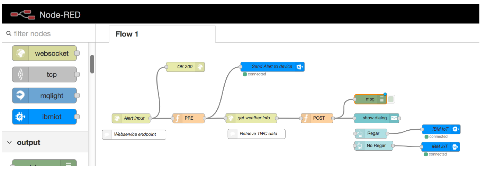

# Ciudades mas verdes- Jardines inteligentes

## Índice

1. [Descripción](https://github.com/aldupe/JardinesInteligentes#descripción)
2. [Caso de negocio](https://github.com/aldupe/JardinesInteligentes#caso-de-negocio)
3. [Prototipo](https://github.com/aldupe/JardinesInteligentes#prototipo)
4. [ROI](https://github.com/aldupe/JardinesInteligentes#roi)
5. [Capturas](https://github.com/aldupe/JardinesInteligentes#capturas)
6. [Node-red flows](https://github.com/aldupe/JardinesInteligentes/tree/master/node-red-flows)

## Descripción

*Proyecto para participar en el Hackaton interno de IBM.* 

¿A quien no le gustaría vivir en una ciudad mas verde? El Objetivo es desarrollar una aplicación rápida y sencilla con los servicios de [Bluemix](https://bluemix.net) y [NodeRed](https://nodered.org/), para facilitar el mantenimiento de los jardines de nuestra ciudad y nuestras casas.

## Caso de negocio

El riego programado desperdicia grandes cantidades de aguas, bien porque haya llovido y no sea necesario riego o puede encharcar zonas de  ademas de no ser efectivo y encharcar posibles zonas de jardín oHoy en día podríamos pensar en sensorizar cada una de las farolas y cada uno de los parques. Esto conllevaría un gasto muy elevado.
Sin embargo con este proyecto nos aprovechamos de los millones de sensores que ya tenemos disponibles gracias a [The Weather Channel](https://weather.com) y de los que podemos obtener información como el clima, temperatura, horas del sol, niveles de CO2, etc...

### Funcionalidades

- **Jardín incorpora el riego automatizado**: Este riego automático a parte de recoger los datos de los sensores que el jardín tiene distribuidos, se integra con el servicio de The **Weather Channel** para conocer las condiciones meteorológicas y poder ajustar el riego a cada momento en función de la climatología. 
- **Sistema de riego y nutrición simultáneo **: El sensor es capaz de detectar humedad, temperatura, luz y abono. Con node red somos capaces de analizar esos datos y definir alertas al equipo de mantenimiento en función de las necesidades de cada zona del jardín.
- **Detección de mantenimiento**: Cada jardín tiene definido el tipo de planta. El sistema accede a un catalogo de plantas con sus especificaciones. Ademas, almacena las tareas de cura y mantenimiento realizadas en cada zona, cantidad de agua consumida , luz, abono, para poder tener el histórico de cada jardín y determinar posibles tendencias de problemas a futuro.

## Prototipo

El prototipo se ha probado con una Raspberry PI 3, sensor DTH11 , display del Sense Hat para poder hacer prueba de concepto a un cliente.

La conexión se ha realizado con **Watson IoT platform**.para conectar sensor y poder recibir sus datos y NodeRed para crear aplicación y crear flujo de conexión de datos en  Cloudant,  Db2 warehouse on cloud para analítica de datos y the Weather company para predicciones.

## ROI

Respecto a la parte economica: 

Tendríamos el ahorro de no regar innecesariamente si en las próximas horas hay un porcentaje de lluvia del 80% consultando condiciones climáticas.

Optimizar los viajes de los jardineros responsables de mantener el jardín:Solo irían en caso necesario, cuando reciban ciertas alertas. Ademas de tener el jardín monitorizado y saber lo que necesita cada planta porque saben en las condiciones en las que se encuentran.

Respecto a la calidad de los parques y jardines: Ganamos en vida, alegría y un ambiente confortable que proporcionan los parques en ciudades donde ladrillo y asfalto nos invade..
 

## Capturas

Grafico esquemático del prototipo :

La siguiente captura de pantalla muestra el flujo de NodeRed implementado para hacer la detección del riego:

La siguiente captura de pantalla muestra el flujo de NodeRed implementado para hacer el prototipo del gateway del jardín:

